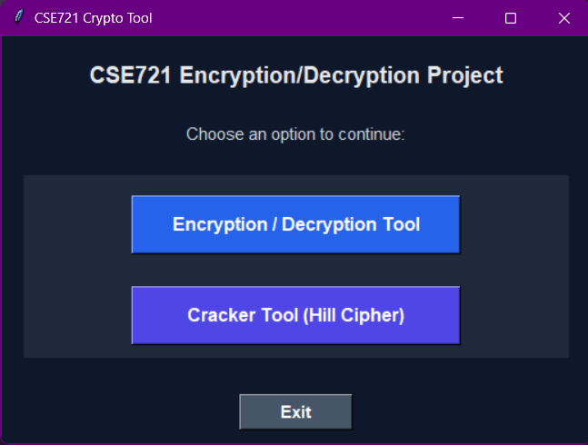

# Encryption/Decryption Tool

This project focuses on the implementation of several classical cryptographic algorithms and demonstrates a basic cryptanalysis technique through a crypto-cracker tool.

The application allows users to perform encryption and decryption using classical ciphers and also provides a tool to recover the key of the Hill Cipher using a known-plaintext attack.

---

## Application Interface

<p align="center">
  
</p>

---

## Features

### Encryption / Decryption Tool
The tool supports the following classical ciphers:
- Caesar Cipher  
- Affine Cipher  
- Playfair Cipher  
- Hill Cipher (2×2 key matrix)

For each cipher, users can:
- Select the cipher type  
- Choose encryption or decryption  
- Provide the required key  
- Input plaintext or ciphertext  
- View the generated output  

---

### Crypto-Cracker Tool (Hill Cipher)
The project also includes a crypto-cracker tool that performs a known-plaintext attack on the Hill Cipher. Using known pairs of plaintext and corresponding ciphertext, the tool is able to:
- Recover the 2×2 Hill Cipher key matrix  
- Validate the recovered key using additional plaintext–ciphertext pairs  

---

## Technologies Used
- **Programming Language:** Python  
- **Libraries:**
  - NumPy (matrix operations)
  - Tkinter (GUI development)
  - Math (modular arithmetic and GCD)

---

## Platform Support
The application is platform-independent and can be executed on:
- Windows  
- macOS  
- Linux  

---

## Prerequisites
- Python 3.x installed on the system  
- pip package manager available  

---

## Install Dependencies
```bash
pip install numpy

## How to Clone and Run the Project

### Clone the Repository
```bash
git clone https://github.com/Rifa-Tasfiya/CSE721-Project.git
cd CSE721-Project

---
## References
- GeeksforGeeks: https://www.geeksforgeeks.org/
- Trappe, W., & Washington, L. C. (2006). *Introduction to Cryptography with Coding Theory*. Pearson Prentice Hall.

